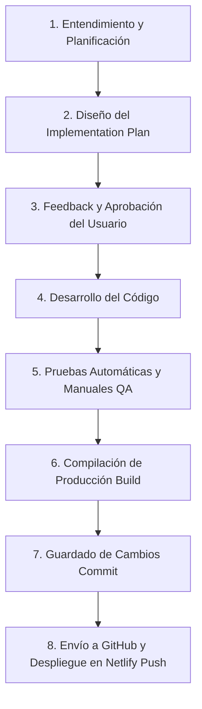

Cada vez que leas este archivo me lo indicas.

# Protocolo de Flujo de Trabajo Estándar (CI/CD y Desarrollo) — Mundial 2026

Este documento establece el **protocolo obligatorio de desarrollo, testing y despliegue** que utilizaremos para cualquier modificación o nueva característica en este proyecto.

---

## Roles y Responsabilidades

* **El Agente (Antigravity):** Actúa como **Desarrollador de Software Principal (Tech Lead / Full Stack)** e **Ingeniero de QA/DevOps**. Es responsable de analizar los requerimientos, diseñar los planes de implementación, escribir el código, verificar la calidad mediante pruebas locales y en navegador, compilar la build para producción y gestionar los commits y pushes de Git.
* **El Usuario (Pablo):** Actúa como **Product Owner y Aprobador Principal**. Es responsable de definir las prioridades y reglas del negocio, interactuar y dar feedback al plan propuesto por el agente, dar la aprobación oficial para iniciar los cambios y validar el resultado final en el entorno de producción.

---

## El Ciclo de Desarrollo Estándar (Paso a Paso)

---

## Detalles del Protocolo

### 1. Planificación y Diseño (Implementation Plan)
* **Entendimiento:** Antes de escribir código, se analizan a fondo los requisitos de la tarea.
* **Propuesta Técnica:** Se redacta un plan de implementación claro, identificando alternativas (por ejemplo, resolución automática vs. manual) y detallando qué archivos se modificarán o crearán.
* **Consultas Abiertas:** Si hay dudas de diseño o arquitectura, se plantean explícitamente en el plan.
* **Aprobación Obligatoria:** **No se realiza ningún cambio de código hasta que el usuario apruebe formalmente el plan.**

### 2. Desarrollo e Integración
* **Código Limpio:** Se implementan los cambios siguiendo las mejores prácticas de la stack (React + TypeScript + Tailwind CSS).
* **Consistencia Estética:** Las nuevas vistas y componentes deben mantener y potenciar el diseño visual premium existente en la aplicación (colores, sombras, estados activos).

### 3. Pruebas y Verificación (QA)
* **Testing en Navegador:** Se verifica que la aplicación corra correctamente de forma local en `http://localhost:5173/`.
* **Cero Errores:** Se valida mediante subagentes de testing que todas las pestañas carguen y no haya excepciones de JavaScript ni advertencias en la consola del desarrollador.
* **Evidencias:** Se crea un reporte de cierre (`walkthrough.md`) con capturas de pantalla y grabaciones para demostrar visualmente el correcto funcionamiento.

### 4. Preparación para Producción e Integración Continua (CI/CD)
* **Compilación (Build):** Se ejecuta localmente `npm run build` para garantizar que TypeScript compile sin errores de tipos o variables huérfanas antes de subir los cambios.
* **Guardado de Cambios (Git Commit):** Se realiza el commit de los archivos en la rama correspondiente (por ejemplo, `master`) con mensajes descriptivos bajo convenciones de commits semánticos (`feat:`, `fix:`, etc.).
* **Despliegue Automático (Git Push & Netlify):** Se realiza el `git push` hacia GitHub. **IMPORTANTE:** El Agente debe solicitar la confirmación explícita del usuario antes de ejecutar el push. El push disparará los webhooks de Netlify, compilando y actualizando el sitio en producción.

---

## Control de Cambios (Changelog)

Cualquier cambio, corrección o nueva funcionalidad implementada en el proyecto bajo el protocolo estándar de desarrollo debe registrarse en el archivo [CHANGELOG.md](file:///c:/Users/Pablo/Desktop/Laboratorio/Mundial/CHANGELOG.md).

### Reglas de Uso de CHANGELOG.md:
1. **Orden Cronológico:** Los registros se listan de forma cronológica, de más reciente a más antiguo (los más nuevos primero).
2. **Tipos de Tareas:** Se debe categorizar cada tarea usando prefijos semánticos comunes (ej. `feat`, `fix`, `docs`, `perf`).
3. **Detalles Clave:** Para cada entrada se debe detallar:
   - **Objetivo:** Una breve descripción de qué problema se resolvió o qué funcionalidad se añadió.
   - **Estado:** Indicar la fase en la que se encuentra (ej. "Completado, verificado en QA y desplegado").
4. **Responsabilidad:** Al finalizar un push y comprobar su correcto despliegue, el Agente debe actualizar `CHANGELOG.md` documentando los cambios realizados.

